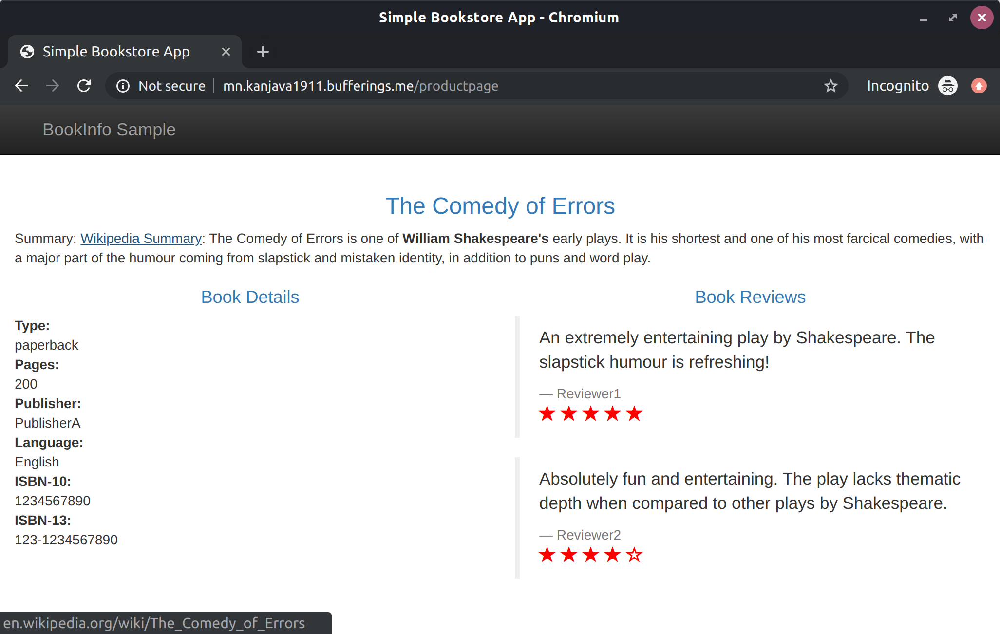
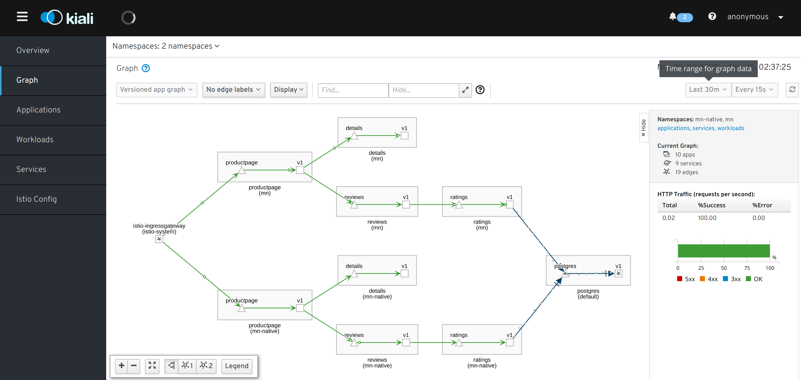
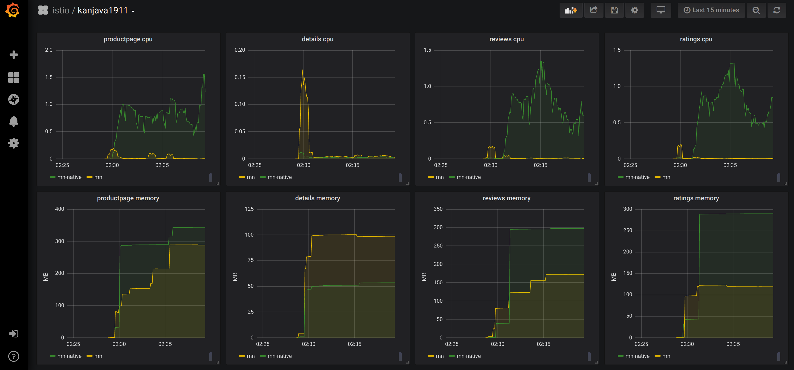

# kanjava201911

I played with Micronaut on Istio on k3d.

## Prerequisite

The following tools are to be installed:

* GraalVM CE 19.2.1
* Gradle
* Docker
* k3d
* kubectl

## Prepare Env

### Create k3d cluster

```sh
# Create k3d cluster without traefik
❯ k3d create --name kanjava1911 --server-arg --no-deploy --server-arg traefik

# Switch kubectl to use k3d
❯ export KUBECONFIG="$(k3d get-kubeconfig --name='kanjava1911')"

# Wait for a while k3d to be ready like this:
❯ kubectl get svc,pod -A
NAMESPACE     NAME                 TYPE        CLUSTER-IP   EXTERNAL-IP   PORT(S)                  AGE
default       service/kubernetes   ClusterIP   10.43.0.1    <none>        443/TCP                  34s
kube-system   service/kube-dns     ClusterIP   10.43.0.10   <none>        53/UDP,53/TCP,9153/TCP   34s

NAMESPACE     NAME                                          READY   STATUS    RESTARTS   AGE
kube-system   pod/local-path-provisioner-58fb86bdfd-t22q6   1/1     Running   0          18s
kube-system   pod/coredns-57d8bbb86-zpxw7                   1/1     Running   0          18s
```

### Install Istio

```sh
# Create namespace
❯ kubectl apply -k env/k8s/namespace

# Install Istio CRDs
❯ helm template env/istio/istio-1.3.5/install/kubernetes/helm/istio-init --name istio-init --namespace istio-system | kubectl apply -f -

# Wait for the CRDs created
❯ kubectl -n istio-system wait --for=condition=complete job --all

# Install Istio
❯ helm template env/istio/istio-1.3.5/install/kubernetes/helm/istio --name istio --namespace istio-system | kubectl apply -f -
```

### Configure IngressGateway

```sh
# Configure
❯ kubectl apply -k env/k8s/gateway

# Check
❯ kubectl get gateway,virtualservice
NAME                                              AGE
gateway.networking.istio.io/kanjava1911-gateway   50s

NAME                                           GATEWAYS                HOSTS                                   AGE
virtualservice.networking.istio.io/mn-native   [kanjava1911-gateway]   [mn-native.kanjava1911.bufferings.me]   50s
virtualservice.networking.istio.io/mn          [kanjava1911-gateway]   [mn.kanjava1911.bufferings.me]          50s

```

### Run DB on default namespace

```sh
# Run DB
❯ kubectl apply -k env/k8s/postgres

# Check
❯ kubectl get svc,pods
NAME                 TYPE        CLUSTER-IP     EXTERNAL-IP   PORT(S)    AGE
service/kubernetes   ClusterIP   10.43.0.1      <none>        443/TCP    26m
service/postgres     ClusterIP   10.43.228.38   <none>        5432/TCP   13s

NAME                            READY   STATUS    RESTARTS   AGE
pod/postgres-7dbb5c6975-2vrfp   1/1     Running   0          13s
```

## Build & Deploy Applications

### Build Apps

```sh
# Build Normal Apps
❯ ./scripts/buildNormal.sh 

# Build Native Apps (this will take around 30 mins)
❯ ./scripts/buildNative.sh 
```

### Deploy Apps

```sh
# Deploy Normal Apps
❯ ./scripts/deployNormal.sh

# Deploy Native Apps
❯ ./scripts/deployNative.sh
```

### Check the deployment

```sh
# Check Normal Apps
❯ kubectl get pod,svc -n mn
NAME                              READY   STATUS    RESTARTS   AGE
pod/reviews-6c4c9f889d-ws4pc      2/2     Running   0          61s
pod/productpage-76db75856-qp9h7   2/2     Running   0          55s
pod/details-5f54f8964d-vgbhv      2/2     Running   0          63s
pod/ratings-75555b8cf8-wqf4h      2/2     Running   0          58s

NAME                  TYPE        CLUSTER-IP      EXTERNAL-IP   PORT(S)    AGE
service/details       ClusterIP   10.43.243.15    <none>        8080/TCP   63s
service/reviews       ClusterIP   10.43.195.169   <none>        8080/TCP   61s
service/ratings       ClusterIP   10.43.224.197   <none>        8080/TCP   58s
service/productpage   ClusterIP   10.43.131.29    <none>        8080/TCP   55s
```

```sh
# Check Native Apps
❯ kubectl get pod,svc -n mn-native
NAME                               READY   STATUS    RESTARTS   AGE
pod/details-7564cb8b84-jk24k       2/2     Running   0          15m
pod/reviews-6889c45588-nsbzw       2/2     Running   0          15m
pod/productpage-5cf87474fc-6ckgv   2/2     Running   0          15m
pod/ratings-7bcc9f46-gg2hh         2/2     Running   2          15m

NAME                  TYPE        CLUSTER-IP      EXTERNAL-IP   PORT(S)    AGE
service/details       ClusterIP   10.43.38.83     <none>        8080/TCP   15m
service/reviews       ClusterIP   10.43.220.178   <none>        8080/TCP   15m
service/ratings       ClusterIP   10.43.239.181   <none>        8080/TCP   15m
service/productpage   ClusterIP   10.43.59.54     <none>        8080/TCP   15m
```

## Check APIs

Now the Micronaut Normal & Native apps are running on the Istio. You can check them with the host name `mn.kanjava1911.bufferings.me` and `mn-native.kanjava1911.bufferings.me` for the gateway IP:

```sh
# Get gateway IP
❯ GATEWAY_IP=$(kubectl get svc -n istio-system istio-ingressgateway -o jsonpath="{.status.loadBalancer.ingress[0].ip}")

# e.g. mn.kanjava1911.bufferings.me
❯ curl -s -H "Host: mn.kanjava1911.bufferings.me" "http://${GATEWAY_IP}/api/v1/products" | jq
[
  {
    "id": 0,
    "title": "The Comedy of Errors",
    "descriptionHtml": "<a href=\"https://en.wikipedia.org/wiki/The_Comedy_of_Errors\">Wikipedia Summary</a>: The Comedy of Errors is one of <b>William Shakespeare's</b> early plays. It is his shortest and one of his most farcical comedies, with a major part of the humour coming from slapstick and mistaken identity, in addition to puns and word play."
  }
]

❯ curl -s -H "Host: mn.kanjava1911.bufferings.me" "http://${GATEWAY_IP}/api/v1/products/1" | jq
{
  "id": 1,
  "author": "William Shakespeare",
  "year": 1595,
  "type": "paperback",
  "pages": 200,
  "publisher": "PublisherA",
  "language": "English",
  "ISBN-10": "1234567890",
  "ISBN-13": "123-1234567890"
}

❯ curl -s -H "Host: mn.kanjava1911.bufferings.me" "http://${GATEWAY_IP}/api/v1/products/1/reviews" | jq
{
  "id": "1",
  "reviews": [
    {
      "reviewer": "Reviewer1",
      "text": "An extremely entertaining play by Shakespeare. The slapstick humour is refreshing!",
      "rating": {
        "stars": 5,
        "color": "red"
      }
    },
    {
      "reviewer": "Reviewer2",
      "text": "Absolutely fun and entertaining. The play lacks thematic depth when compared to other plays by Shakespeare.",
      "rating": {
        "stars": 4,
        "color": "red"
      }
    }
  ]
}
```

## Check Page

You can open the page with your browser if you set the IP and Host in your `hosts` file like this:

```sh
❯ sudo echo "${GATEWAY_IP} mn.kanjava1911.bufferings.me" | sudo tee -a /etc/hosts
192.168.112.2 mn.kanjava1911.bufferings.me

❯ sudo echo "${GATEWAY_IP} mn-native.kanjava1911.bufferings.me" | sudo tee -a /etc/hosts
192.168.112.2 mn-native.kanjava1911.bufferings.me
```

* Normal: http://mn.kanjava1911.bufferings.me/productpage
* Native: http://mn-native.kanjava1911.bufferings.me/productpage



## Check Service Graph

When you connect to kiali, you can check the service graph.

```sh
# Port Forward to Kiali
❯ kubectl port-forward -n istio-system svc/kiali 20001:20001
Forwarding from 127.0.0.1:20001 -> 20001
Forwarding from [::1]:20001 -> 20001
```

http://localhost:20001



## Check Grafana

```sh
# Port Forward to Grafana
❯ kubectl port-forward -n istio-system svc/grafana 3000:3000
Forwarding from 127.0.0.1:3000 -> 3000
Forwarding from [::1]:3000 -> 3000
```

http://localhost:3000



## Delete Cluster

```sh
❯ k3d delete --name kanjava1911
```